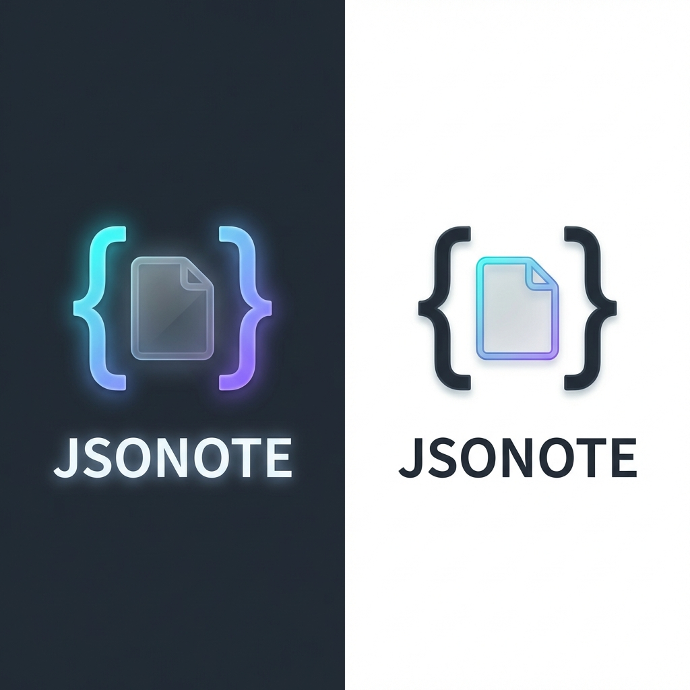

# JSONOTE (v0.1.0)

[](./README.md)


> **GitHub 연동 및 MCP 지원을 갖춘 궁극의 JSON 기반 노트 애플리케이션.**

JSONOTE는 노트를 1급 JSON 데이터로 다루는 개발자 중심의 고성능 노트 앱입니다. GitHub와 매끄럽게 동기화하고, 노션(Notion)처럼 복잡한 계층 구조를 관리하며, MCP(Model Context Protocol)를 통해 AI의 힘을 빌려보세요.

---

## 🚀 주요 기능

### 1. GitHub 네이티브 동기화
- 모든 노트는 개인 GitHub 저장소에 `.json` 파일로 저장됩니다.
- Git을 통한 완벽한 버전 관리.
- 충돌 해결 로직을 포함한 실시간 동기화.

### 2. 노션 영감의 워크스페이스
- **무한 계층 구조**: 페이지 안에 페이지를 중첩하여 체계적인 지식 베이스를 구축하세요.
- **데이터베이스 뷰**: **리스트, 테이블, 보드** 뷰 사이를 자유롭게 전환하세요.
- **커스텀 속성**: 모든 노트에 메타데이터 필드(텍스트, 숫자, 날짜 등)를 추가할 수 있습니다.

### 3. MCP (Model Context Protocol) 통합
- 외부 AI 도구(Notion MCP, GitHub MCP 등)와 연결하세요.
- 에디터 내에서 AI 도구를 직접 호출하여 노트 내용을 처리할 수 있습니다.
- 브라우저 CORS 제한을 우회하는 서버 사이드 프록시 구현.

### 4. 개발자 친화적 UI
- **글래스모피즘 디자인**: 프리미엄 흑연색(Obsidian-dark) 테마.
- **나눔고딕 타이포그래피**: 깔끔하고 전문적인 로컬 폰트 렌더링.
- **마크다운 지원**: 구문 강조 및 간편한 서식 도구 제공.

---

## 🛠️ 빠른 시작

### 설치
```bash
npm install
npm run dev
```

### 설정
1. 앱 내 **설정(Settings)**으로 이동합니다.
2. **GitHub Personal Access Token**을 입력합니다.
3. `Owner`, `Repo`, `Branch`를 지정합니다.
4. 저장 시 노트가 자동으로 동기화됩니다.

---

## 📝 문서

- [시작 가이드](./docs/GUIDE.md) | [English](./docs/GUIDE.md)
- [MCP 설정 가이드](./docs/MCP_SETUP.md) | [English](./docs/MCP_SETUP.md)
- [보안 및 개인정보](./docs/SECURITY.md) | [English](./docs/SECURITY.md)

---

## ⚖️ 라이선스
Copyright (c) 2026 JSONOTE Team. All rights reserved.
